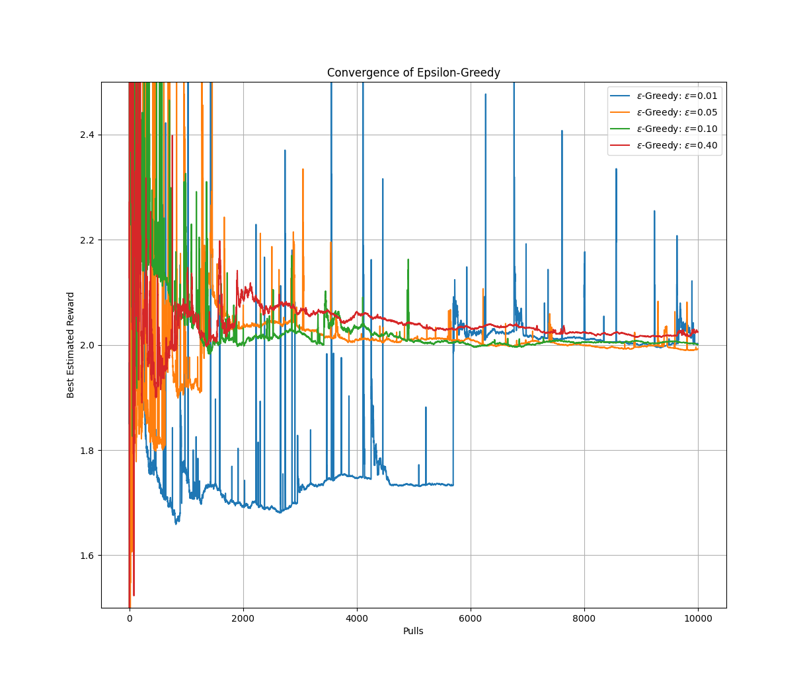
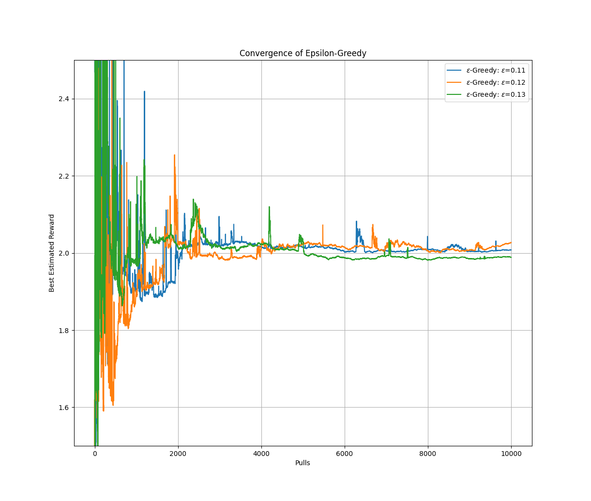
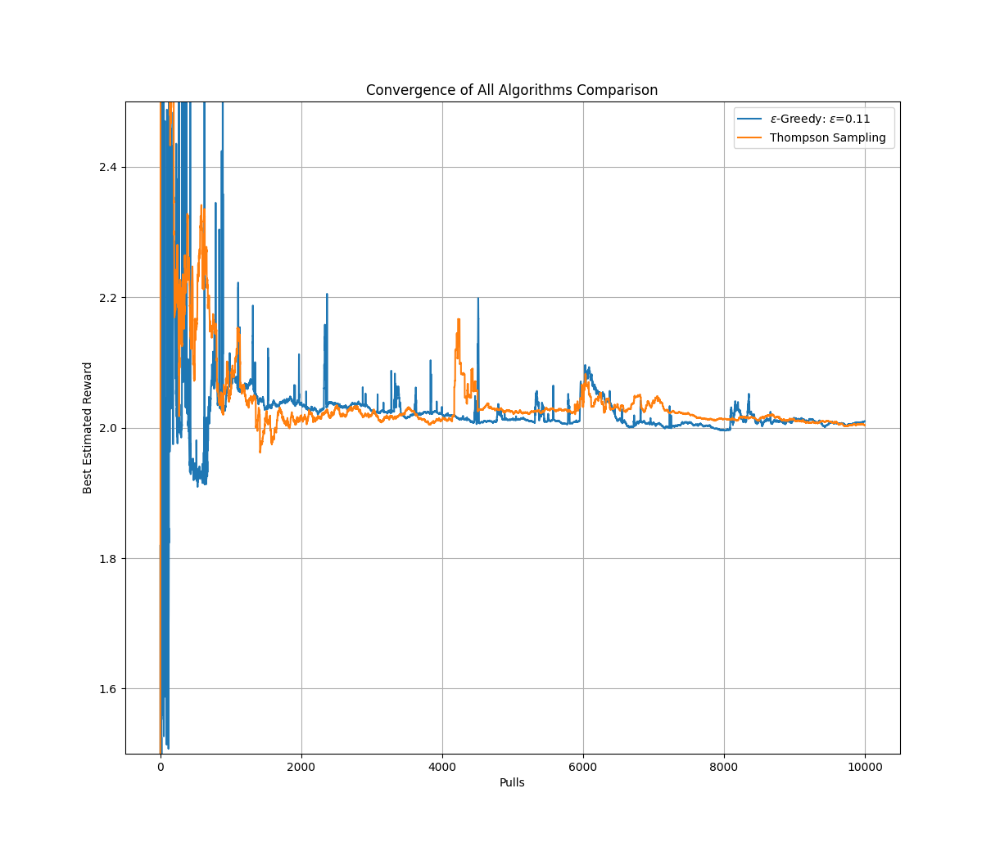
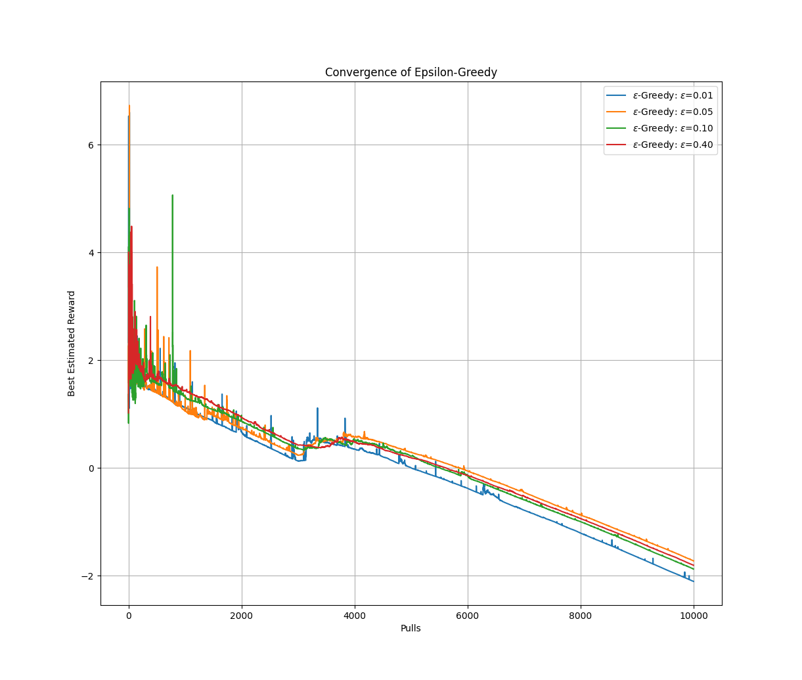
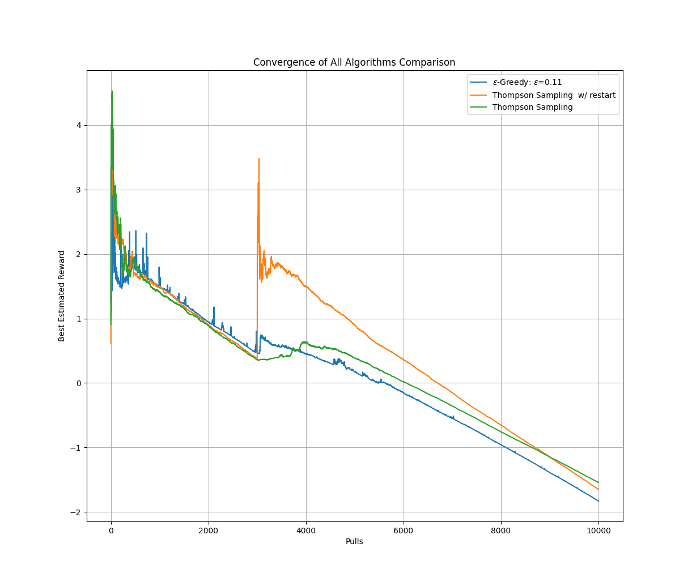

# Homework 2: Explore Exploit / Multi-Armed Bandit

## Usage

The python file contains a simple CLI to demonstrate the convergence of epsilon-greedy and thompson sampling. The first argument is one of `epsilon_greedy`, `thompson_sampling`, and `all`, and chooses which algorithm to perform the experiments with. The optional parameters are:

- `--verbose, -v`: print extra progress, verbose mode
- `--drift, -d`: enable drift in the rewards (part 2)
- `--epsilons, -e`: perform epsilon greedy with these epsilons (default is 0.01, 0.05, 0.1, 0.4)
- `--restart-thompson, -rt`: restart thompson sampling at step 3000
- `--help, -h`: show help screen.

Thus, Part 1 can be performed by running

`python HW2_Glenn_Jaren.py all`

And Part 2 can be performed by running

`python HW2_Glenn_Jaren.py all --drift --restart-thompson`

## Results

### Part 1

Looking at the convergence rates, it definitely seemed like 0.5 and 0.10 were competing for the best for most of the graph. This led me to play around with the epsilon I ran it against and I eventually landed on this:

11% seemed to both perform about optimally in every experiment I ran. It converges fairly quickly and (for the most part) seems stick to that 2.0 optimal estimate. Next I compared that to Thompson Sampling.

While both algorithms perform fairly well, Thompson Sampling seems to converge just a little bit faster. It has a few more "wild" peaks but it ends up in the same spot.

### Part 2

Comparing the given epsilons again, it seems like the 1% epsilon is doing worse than it was beforehand. Likely it doesn't explore enough to find the new averages after the shift so it's just permanently lower than the others.

Not much changed here in regards to the optimal epsilon. ~11% again seemed to perform the best. It appears as though, after the big shift at time step 3000, 11% has the right amount of randomness to re-find the optimal reward, but not enough that it explores too much and takes longer to converge. This is shown even without the drift/shift but it's more obvious here.

Thompson sampling didn't seem to perform as well with the drift - it quickly finds a new mean but then its estimated reward seems too high, and other convergence rates seem quicker. With the restart, however, it's clear that Thompson Sampling does quite well again as it's able to lower its estimate appropriately as the drift occurs after the shift.
