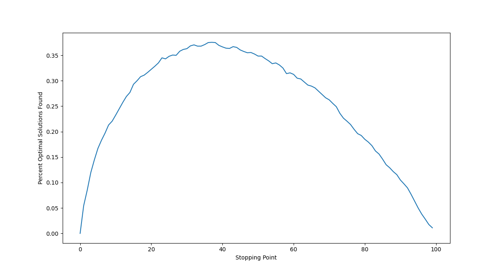
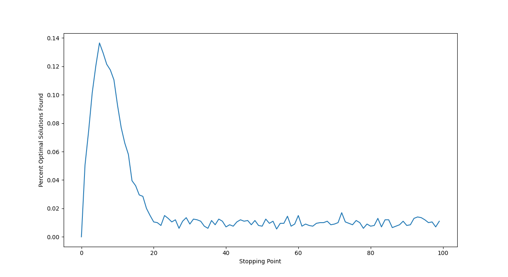
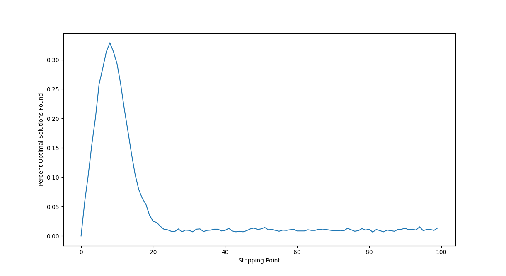

# Code Guide

## Setup

The code expects numpy and matplotlib to be available.

## Part 1

- To run the experiment: `HW1_Glenn_Jaren.py part1`
- To run the tests: `HW1_Glenn_Jaren part1 --test`

## Part 2

- To run the experiment against uniform data: `HW1_Glenn_Jaren.py part1 uniform`
- To run the experiment against normal data: `HW1_Glenn_Jaren.py part1 normal`

The script also prints help if you enter bad input.

# Solutions

## Part 1

The above graph matches up very well with what we would expect. It peaks around 37% and continues to decrease afterwards.

## Part 2

## Uniform

## Normal

While these two graphs aren't exactly the same, it makes sense that the threshold is significantly lower when we apply a penalty for how many times we explore the dataset. Uniform ended up at around 5% and Normal at around 8%.
