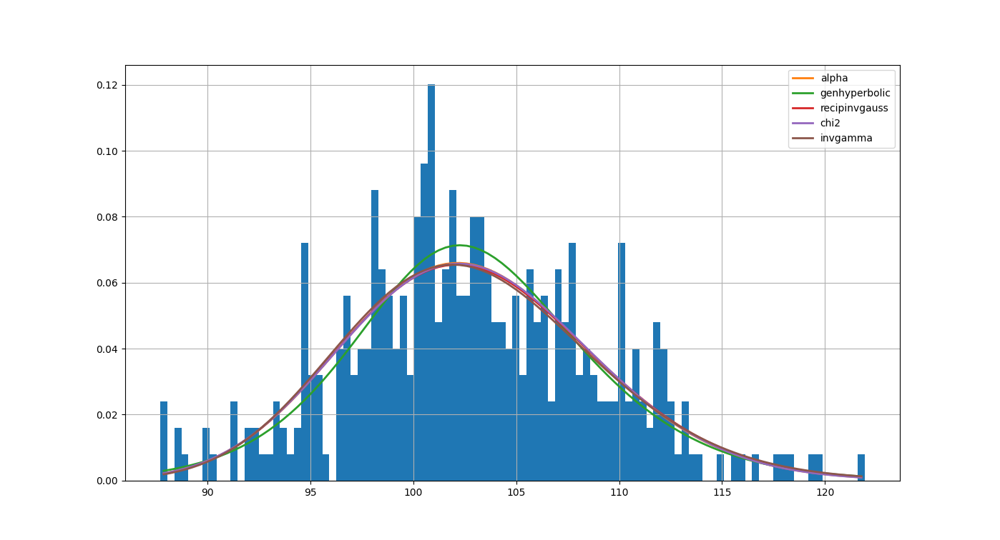

# HW3: Options as a Financial Tool

## Usage

A simple CLI has been built to allow for running the different parts of the homework. A basic help/guide message can be shown using `python main.py --help`.

### The first argument must be the part of the assignment to run. (p1, p2)

### The other parameters include

- `-p`, `--plot`: plot the simulated paths
- `--no-fit`: skip distribution fit on part 2

## Results

### Simple Option

Using the given source code as a guide, I performed many simulations which resulted in plots like this:

The price seemed to hover around 8.03, with some variation in both directions.

### Distribution Fit

Using the `fitter` package on both stocks with the default sum squared error as the goodness of fit metric, I found the following distributions performed the best:

#### Stock 1: F distribution

- dfn: 4688.5279
- dfd: 36772.7300
- loc: -130.2911
- scale: 230.1985

#### Stock 2: Alpha distribution

- alpha: 25.8826
- loc: -54.3223
- scale: 4061.9743

### Outperforming Option

The average of the first stock is 99.91 and the second is 102.88.

When the value of the original asset in part 1 is deteremined by the former, the price isn't affected much because it is so close to the original strike price of 100 (the initial price).

However, when doing the same with the latter average the price drops to 5.14, likely because the stock performed better.

And finally, I interpreted the last section as setting a strike price of `min(max(stock1), max(stock2))`, or 112.50. This resulted in an option price of 0.00 since the first stock will enver outperform the max value of either of the two options.
