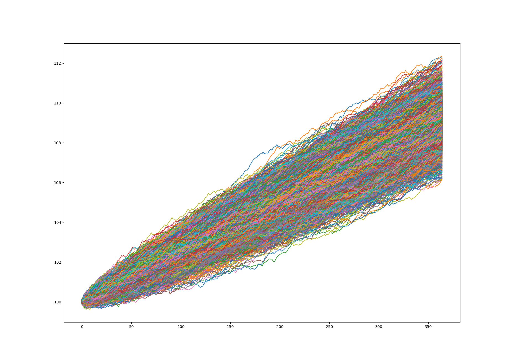

# HW3: Options as a Financial Tool

## Usage

A simple CLI has been built to allow for running the different parts of the homework. A basic help/guide message can be shown using `python main.py --help`.

### The first argument must be the part of the assignment to run. The options are:

- `simple_option`: find price of vanilla European Option (Part 1)
- `fit_distribution`: perform a distribution fit on a given stock

### The other parameters include

- `-s`, `--simulations`: number of simulations to run (simple_option only)
- `-p`, `--plot`: plot the simulated paths (simple_option only)
- `-d`, `--data`: path to the csv to run a distribution fit on (fit_distribution_only)

## Results

### Part 1

Using the given source code as a guide, I performed many simulations which resulted in plots like this:

The price seemed to hover around 8.03, with some variation in both directions.

### Part 2

Using the `fitter` package on both stocks with the default sum squared error as the goodness of fit metric, I found the following distributions performed the best:

#### Stock 1: F distribution

- dfn: 4688.5279
- dfd: 36772.7300
- loc: -130.2911
- scale: 230.1985

#### Stock 2: Alpha distribution

- alpha: 25.8826
- loc: -54.3223
- scale: 4061.9743
